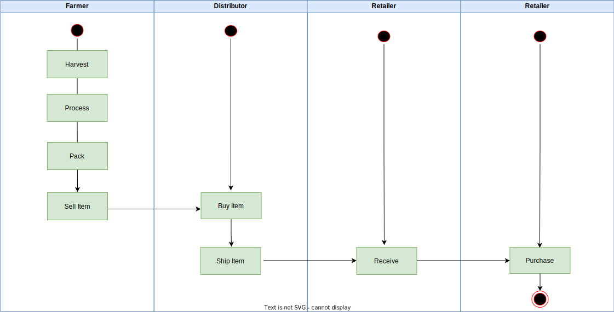
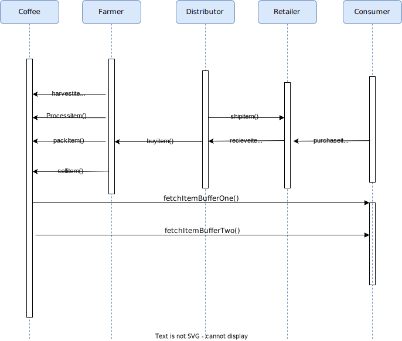
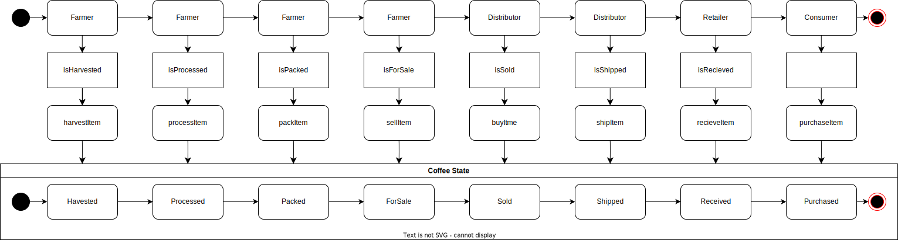

# Supply Chain Decentralized Application 

## Rinkeby Test Network Address

0xc5980157DA44A2e9A8379F17A75e75436145fC06

## Versions Used 

* Truffle v5.5.2 (core: 5.5.2)
* Ganache v7.0.1
* Solidity - 0.8.11 (solc-js)
* Node v16.13.2
* Web3.js v1.5.3

## Testing Output

Contract Owner: accounts[0]  0x627306090abaB3A6e1400e9345bC60c78a8BEf57
Farmer: accounts[1]  0xf17f52151EbEF6C7334FAD080c5704D77216b732
Distributor: accounts[2]  0xC5fdf4076b8F3A5357c5E395ab970B5B54098Fef
Retailer: accounts[3]  0x821aEa9a577a9b44299B9c15c88cf3087F3b5544
Consumer: accounts[4]  0x0d1d4e623D10F9FBA5Db95830F7d3839406C6AF2

  Contract: SupplyChain
    ✓ Testing smart contract function harvestItem() that allows a farmer to harvest coffee (1294ms)
    ✓ Testing smart contract function processItem() that allows a farmer to process coffee (1088ms)
    ✓ Testing smart contract function packItem() that allows a farmer to pack coffee (1090ms)
    ✓ Testing smart contract function sellItem() that allows a farmer to sell coffee (1106ms)
    ✓ Testing smart contract function buyItem() that allows a distributor to buy coffee (1116ms)
    ✓ Testing smart contract function shipItem() that allows a distributor to ship coffee (1090ms)
    ✓ Testing smart contract function receiveItem() that allows a retailer to mark coffee received (1115ms)
    ✓ Testing smart contract function purchaseItem() that allows a consumer to purchase coffee (1088ms)
    ✓ Testing smart contract function fetchItemBufferOne() that allows anyone to fetch item details from blockchain (47ms)
    ✓ Testing smart contract function fetchItemBufferTwo() that allows anyone to fetch item details from blockchain (38ms)

  10 passing (9s)

  ## UML Diagrams 
  
  
  
  
  
    
    
  
      
      
  

  ## Additional Libraries Used

